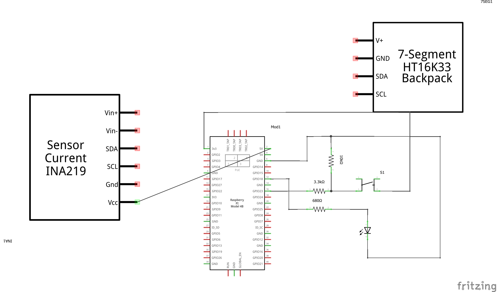

# RaspberrySwitch
Led kigyújtása mikrokapcsolóval (Raspberry)

## Működés
Ha  nyomógmbot megnyomjuk, a led bekapcsol, ha mégegyszer, akkor kikapcsol.

## Kapcsolási rajz



## Forrás
[raspberry](https://www.raspberrypi.org/)

## Forráskód

```py
import RPi.GPIO as GPIO
import time
GPIO.setwarnings(False)
GPIO.setmode(GPIO.BOARD)
GPIO.cleanup()

pinIn = 16
pinOut = 12
GPIO.setup(pinOut, GPIO.OUT)
GPIO.setup(pinIn, GPIO.IN)

led = False
prevInput = led
tSleep = 0.05

print("Nyomd meg a kapcsolót! Kilép Ctrl-C")

try:
    while True:
        input = GPIO.input(pinIn)
        if (input and (not prevInput)):
            print("Gombnyomás")
            led = not led
        
        GPIO.output(pinOut, led)
        
        prevInput = input
        time.sleep(tSleep)

except KeyboardInterrupt:
    print("Pinek lekapcsolva")
    GPIO.cleanup()
```


